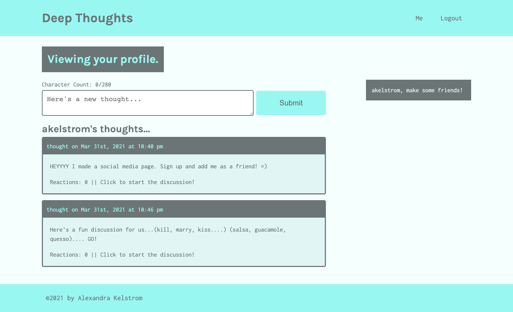

# Deep Thoughts

## Description

I combined all four technologies of the MERN stack (MongoDB, Express.js, React, and Node.js) to build a social media application called Deep Thoughts. Users are able to sign up and create an account, post their thoughts, and interact with other users, just like you might find in the social media apps you use day in and day out in real life. 

I used React Router to make the application behave more like a multi-page application, allowing users to bookmark URLs and use the browser’s forward and back buttons. I also added GraphQL, an open-source data query and manipulation language for APIs that lets you fetch only the data you want from the database when you need it and nothing more.

Finally, I implemented an alternative authentication solution known as a JSON Web Token (JWT). JWTs provide all the data you need in a single string, eliminate the need to save session IDs on the back end, don’t require as many server-side resources, and can be generated anywhere.

## Usage 

Visit my site [here](https://deep-thoughts13.herokuapp.com/)

Social Media MERN app with the following features:
* A user can sign up and log in to the application.
* A user can post their thoughts and view other user's thoughts.
* A user can react, or reply, to a thought.
* A user can befriend other users.

## Tech Used
* MERN Stack
    * MongoDB
    * Express.js
    * React.js
    * Node.js
* JavaScript
* React Router
* Mongoose
* GraphQL
* JSON Web Tokens
* JSX
* CSS

## Credits 

Big thanks to the Upenn LPS Coding Bootcamp instructional team for all their support!

## Questions
If you have questions, feel free to reach out by email at [akelstrom@gmail.com](mailto:akelstrom@gmail.com).
